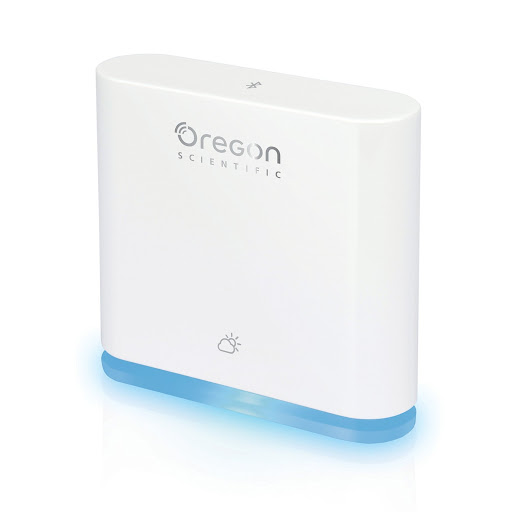
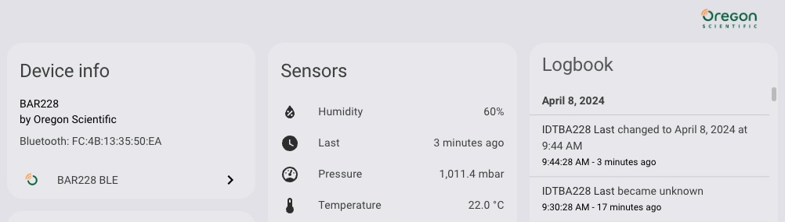

# BAR228
Orgeon Scientific BAR228 Integration for Homeasssistant. *Throw me a github star if you use this!*

*Based on: https://github.com/jdeath/rd200v2 and https://github.com/EtoTen/radonreader/ and the AirThings BLE Homeassistant Integration (https://github.com/home-assistant/core/tree/dev/homeassistant/components/airthings_ble) and https://github.com/vincegio/airthings-ble, and the ESPHome Native Integration (https://esphome.io/components/sensor/radon_eye_ble.html)*

Works with the [BAR228](https://www.oregonscientificstore.com/p-391-oregon-scientific-bar228-weather-ble-connected-weather-sensor-advanced.aspx) units *(identified in BT as IDTBA228)*.

**By default the BAR228 only send data every 15 minutes and only after the first 15 min when new batteries were inserted.**

When you use ESPHome BT proxy, update to at least ESPHome 2022.12.4 to allow data values to work correctly.

If you update to 4.2, you must run Homeassistant 2024.1.0 or later. If you get an error about "close_stale_connections_by_address" you need to update to homeassistant 2024.1.x or revert back to version 4.1 of this integration

If you use a Raspberry Pi built-in BT adapter, the data values may not work after the first update and cause itegration to hang. Option to work around: Use an ESPHome proxy (recommended).

An issue has been created in homeassistant for the BT performance, but it could just be the Raspberry Pi BT adapter stinks! https://github.com/home-assistant/core/issues/90307

For VMWare: A user solved "regularly loosing-connection" on their Win10/Nuc running Home-Assistant in a VMWare Virtual machine by updating from VMware Pro 15 to VMWare (free) Verions 16. 

### Installation Instructions
- Add this repo into HACS
- Install integration
- Restart Homeassistant
- Wait a few minutes and HA should find it automatically
- If not found automatically, Go to Settings->Device and Services->Add Integration (blue button at bottom right) -> search for BAR228
- It should find it and set it up

